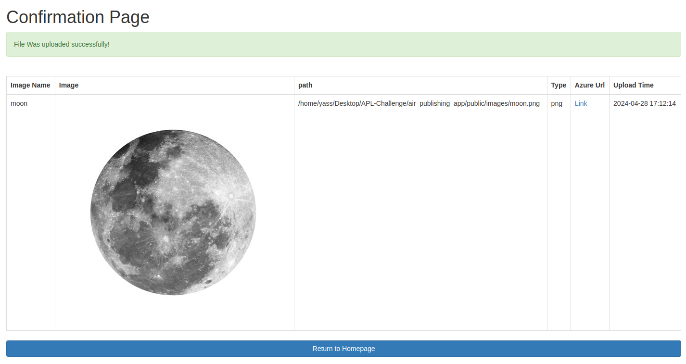

# Project Title
APL PHP Technical Challenge

# Description
This App was created to showcase the process of adding an image to Azure Blob Container.\
The app has two main modes Online & Offline.\
In the online mode, the images are uploaded to a remote Azure Blob Container using the Azure\
Blob Storage REST API.\
On the other hand, the offline mode allows the devs to only save the image\
to a local filesystem that can be accessed through the user interface

Completed Requirements:
* The app is written in PHP.
* The app allows the dev to run in an offline mode
* The app allows only the upload of images in JPG or PNG formats.
* The maximum dimensions of any stored image is be 1024x1024.
* Image is in the apl-recruitment-images Azure Blob Container. Link: https://aplrecruitment.blob.core.windows.net/apl-recruitment-images/moon.png?sv=2022-11-02&ss=bf&srt=sco&sp=rwdlactf&se=2024-05-03T23:04:09Z&st=2024-04-26T15:04:09Z&spr=https&sig=3Z/Ppe8xm08ZUkklVlrr80MfhaPO8O5GKjQ6LaEfymY=
* Details of uploaded images are stored in a database for audit purposes.
* On successful upload, confirmation is displayed to the user alongside the stored
image.
* Error scenarios are handled where identified.

# Technologies
- Language = PHP
- Framework: Symfony
- Database: MySQL
- ORM: Doctrine
- Templates: Twig
- API calls: HttpClient

# Design
The app followed the MVC model =>
 - Model: App/src/Entity/Image (Image table)
 - View: App/templates/base.html.twig / App/templates/confirmation.html.twig
 - Controller: App/src/Controller/MainController:
     uploadImage() / imageUploadConfirmation() / getAllContainerBlobs() / deleteContainerBlob()

# User road map
1- Upload image through the form (Only JPG and PNG image types are allowed)

2- If the form is invalid, an error message will be displayed on the same page:

3- If the form is valid attempt db checks (Campaign already exist?/ DB exception)

4 - If the db checks are Valid, Attempt the API call, if Invalid return error

5 -  If the API call is valid Save the image + return confirmation details

Case 2 => Offline Mode\
1- Go through the same steps as the online mode - apart from the API call to upload to Azure\
2 - If all checks are valid - save the image + return the upload details

# API References
- Azure Blob Storage REST API: https://learn.microsoft.com/en-us/rest/api/storageservices/blob-service-rest-api

# Handled errors
Form Input:
- Bad format images
- Big size images

Image Dimensions:
- Failed to pass the max dimensions check, please choose an image with max dimensions of 1024 x 1024

Database Persist errors:
- Image Name already exists
- Error Saving file

API exceptions:
- Transport exception
- Client Exception
- Redirection Exception
- Server Exception
- Status code Exception

# Extra functions (Added to do some extra checks)
- getCreatedImagesFromContainer (Get all active blobs from the container)
- deleteBlobFromContainer (Delete A certain blob by name)

